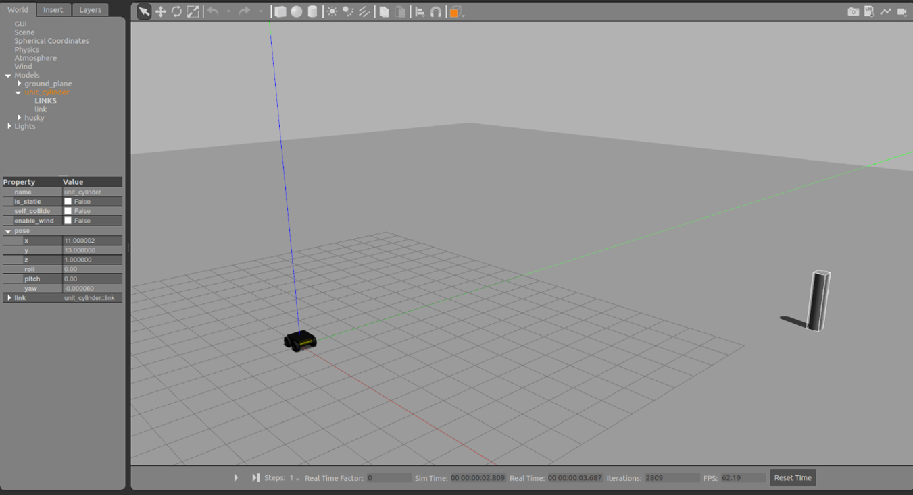

# Husky Robot Simulation with PID Control

## Objective

This project involves simulating a Husky robot in an empty Gazebo world with a single pillar using Robot Operating System (ROS). The main goal is to implement a PID controller to guide the Husky robot towards the pillar and make it stop while facing the pillar.

---

## Task Description
The Husky robot is expected to:
    1. Navigate towards the pillar using PID control.
    2. Stop at a predetermined distance from the pillar.
    3. Align itself such that it faces the pillar upon stopping.
---

## Initial Conditions

### Initial location of Husky and pillar

| Husky Coordinates | Pillar Coordinates | Initial Distance (meters) | Initial Orientation (degree) |
|-------------------|-------------------|---------------------------|-----------------------------|
| (0, 0)            | (11, 13)          | 17.0294                   | 49.7636                     |

---

## PID Control Task
- Control the velocity of the Husky robot towards the pillar.
- Reduce and eventually eliminate the positional error.
- Maintain stability without oscillations or overshooting.

---

## Extra: Testing the Effect of Mass on PID Performance

To evaluate the robustness of the PID controller, the mass of the Husky robot was altered **without modifying the PID gain values**. Two different masses were tested:

- **400 kg**
- **500 kg**

### Observations:
- Only slight variations in the PID performance were observed.
- The Husky maintained good control and successfully reached the predetermined distance in both cases.
- Minor changes in settling time and slight overshooting were noted at higher mass, which is expected due to increased inertia.

---

### Simulation Results

#### Case 1: Husky with 400 kg Mass

#### Case 2: Husky with 500 kg Mass

---

## Recommended Tools

- ROS (Robot Operating System)
- Gazebo Simulator
- RViz (optional, for visualization)
- Python / C++ (for PID implementation)
